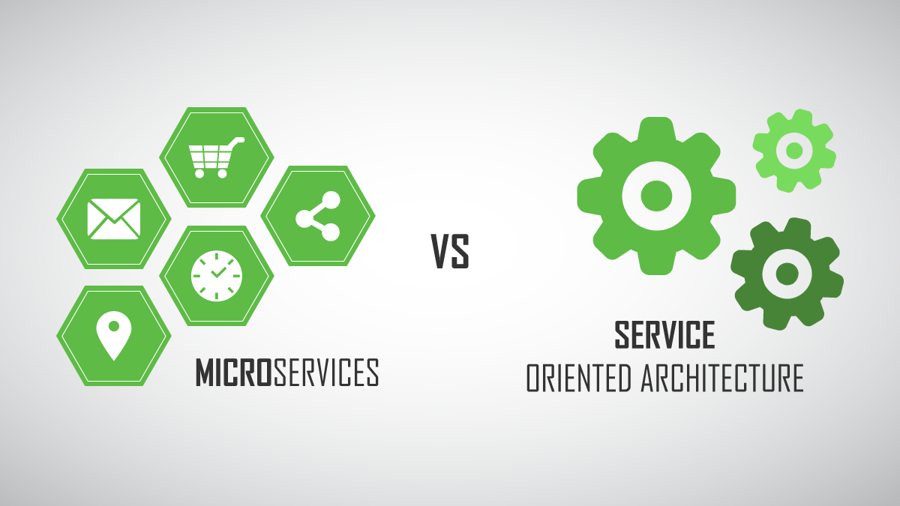

# 微服务与SOA对比

## IBM

如果您在IT领域工作，您可能已经听过SOA与微服务的争论。毕竟，现在每个人都在谈论微服务和敏捷应用程序。

乍一看，这两种方法听起来非常相似。在某些方面，他们是。两者都不同于传统的单片架构，因为每项服务都有自己的责任。两者都受益于一定程度的解耦。

主要区别归结为范围。简而言之，面向服务的体系结构（SOA）具有企业范围，而微服务体系结构具有应用范围。

**注：SOA范围大，着眼于整个企业，而微服务范围小，着眼于应用。**

以下是每种情况的一些非常基本的定义：

- SOA是一项企业级范围的计划，旨在创建可重用，同步可用的服务和API。 这有助于开发人员更快速地创建应用程序，并更轻松地合并来自其他系统的数据。
- 微服务架构是一种用于构建单个应用程序的选项，使该应用程序更加灵活，可扩展且具有弹性。

**SOA是与企业服务的公开性密切相关的，关注的范围更大，是应用与应用之间的通信、服务公开。**

**微服务是与应用架构紧密相关的，关注的范围小，只关注应用本身的范围。**

### 重要性

当你忽视这种差异时，每种方法的许多核心原则都会变得不兼容。 如果您接受他们在范围的差异，您可能很快意识到这两者可能相互补充而不是竞争关系。

以下是这种区别发挥作用的几种情况：

- 重用性。在SOA中，集成的重用性是主要目标，在企业级别，努力实现某种程度的重用性是至关重要的。在微服务架构中，创建在整个应用程序中在运行时重用的微服务组件会导致依赖性降低敏捷性和弹性。微服务组件通常更喜欢通过复制重用代码并接受数据复制以帮助改善解耦。
- 同步调用。 SOA中的可重用服务可在整个企业中使用，主要使用RESTful API等同步协议。但是，在微服务应用程序中，同步调用会引入实时依赖性，从而导致弹性丧失。它还可能导致延迟，从而影响性能。在微服务应用程序中，基于异步通信的交互模式是优选的，例如事件源，其中使用发布订阅模型使微服务组件能够保持最新发生在另一组件中的数据发生的变化。
- 数据重复。在SOA中提供服务的明确目标是让所有应用程序直接在其主要源上同步获取和更改数据，从而减少维护复杂数据同步模式的需要。在微服务应用程序中，每个微服务理想地具有对其所需的所有数据的本地访问，以确保其与其他微服务以及实际上来自其他应用程序的独立性，即使这意味着在其他系统中存在一些数据重复。当然，这种重复增加了复杂性，因此必须与敏捷性和性能的提升相平衡，但这被认为是微服务设计的现实。

## DZone

最近，关于这两种架构之间的差异，或者是否存在任何差异，已经有很多大惊小怪。 为了深入研究引发数百次辩论的这个问题，我将首先简要地定义SOA和微服务架构及其起源，然后我们将对它们进行比较，看看我们如何才能最好地区分它们。

### Service-Oriented Architecture (SOA)

面向服务的体系结构（SOA）是一种软件体系结构，其中应用程序的不同组件通过网络上的通信协议向其他组件提供服务。通信可以涉及简单的数据传递，或者涉及彼此协调连接服务的两个或更多个服务。这些不同的服务执行一些小功能，例如验证付款，创建用户帐户或提供社交登录。

**面向服务的体系结构（SOA）更少的去关注如何模块化应用程序，而更多的是去关注如何通过集成分布式，单独维护和部署的软件组件来组合应用程序。**它通过技术和标准实现，使组件更容易通过网络进行通信和协作，尤其是IP网络。

SOA中有两个主要角色：服务提供者和服务使用者。软件代理可以扮演两种角色。消费者层是用户（人，应用程序的其他组件或第三方）与SOA交互的点，提供者层由SOA中的所有服务组成。

SOA首先在90年代中期得名，当时一家名为Gartner Group的公司认识到软件架构中的这一新兴趋势，采用它并在全球范围内推广它。 通过这样做，他们成功地大大加快了这种架构模式的采用和进一步发展。 但是，使用分布式服务作为软件架构的第一个记录可以追溯到80年代早期。

### Microservices

从某种程度上讲，微服务是面向服务架构（SOA）演化的下一个阶段。基本上说，这种架构类型是开发软件，Web或移动应用程序作为独立服务套件的一种特殊方式 -  又叫做微服务。创建这些服务仅用于一个特定的业务功能，例如用户管理，用户角色，电子商务购物车，搜索引擎，社交媒体登录等。此外，它们彼此之间完全相互独立，这意味着它们可以写入不同的编程语言并使用不同的数据库**集中式服务管理几乎不存在**，微服务使用轻量级HTTP，REST或Thrift API进行相互通信。

这个词本身源于2011年5月在威尼斯附近举办的软件架构师研讨会。他们首次使用“微服务”这一术语来描述参与者所看到的许多人最近一直在探索的共同建筑风格。 2012年5月，同一小组决定将“微服务”作为最合适的名称。然而，微软，亚马逊，Netflix和Facebook等主要科技公司已经使用微服务十多年了。在提出普遍接受的名称之前，其他人称他们为“微网络服务”或“细粒度SOA”。

是的，乍一看，我们似乎在谈论与SOA相同的事情。但是，我将请求微软服务领域的先驱Martin Flower的话，他曾经说过我们应该将SOA视为微服务的超集。

### So, Where’s the Difference?

我们可以说两种架构都有相似之处而不是差异，但是，最终，它们是两种不同类型的架构。 为了支持我的主张，首先，我将以表格的形式介绍将它们区分开来的架构的特定部分。 稍后，我将更详细地阐述其中的一些内容。 开始了！

| **SOA架构**                              | **微服务架构**                           |
| ---------------------------------------- | ---------------------------------------- |
| 最大化应用服务的可重用性                 | 关注于解耦                               |
| 系统的变化需要修改整体结构               | 系统的变化是创造一种新的服务             |
| DevOps和持续交付正在变得流行，但不是主流 | 专注于DevOps和持续交付                   |
| 专注于业务功能的可重用性                 | 更加重视“边界上下文”的概念               |
| 对于通信，它使用企业服务总线（ESB）      | 对于通信使用不那么复杂和简单的消息系统   |
| 支持多种消息协议                         | 使用轻量级协议，如HTTP，REST或Thrift API |
| 为部署到它的所有服务使用通用平台         | 应用服务器并未真正使用，通常使用云平台   |
| 使用容器（如Docker）不太受欢迎           | 容器与微服务一起工作得很好               |
| SOA服务共享数据存储                      | 每个微服务可以具有独立的数据存储         |
| 共同治理和标准                           | 轻松治理，更加注重团队协作和选择自由度   |

我将在上表中显示的某些方面进一步详细说明，并进一步解释其中的差异：

- 开发 - 在这两种体系结构中，可以使用不同的编程语言和工具开发服务，从而为开发团队带来技术多样性。可以在多个团队中组织开发，但是，在SOA中，每个团队都需要了解常见的通信机制。另一方面，通过微服务，服务可以独立于其他服务运行和部署。因此，更容易经常部署新版本的微服务或独立扩展服务。您可以在此处进一步了解微服务的这些优点。
- “边界上下文” -  SOA鼓励共享组件，而微服务试图通过“有界上下文”最小化共享。有界上下文指的是将组件及其数据作为单个单元耦合，具有最小的依赖性。由于SOA依赖于多种服务来满足业务请求，因此基于SOA构建的系统可能比微服务慢。
- 通信 - 在SOA中，ESB可能成为影响整个系统的单点故障。由于每个服务都通过ESB进行通信，如果其中一个服务速度变慢，它可能会阻塞ESB请求该服务。另一方面，微服务在容错方面要好得多。例如，如果一个微服务有内存故障，那么只有那个微服务会受到影响。所有其他微服务将继续定期处理请求。
- 互操作性 -  SOA通过其消息传递中间件组件促进多个异构协议的使用。微服务试图通过减少集成选择的数量来简化架构模式。因此，如果要在异构环境中使用不同协议集成多个系统，则需要考虑SOA。如果可以通过相同的远程访问协议访问所有服务，那么微服务对您来说是更好的选择。
- 大小 - 最后但并非最不重要的是，SOA和微服务之间的主要区别在于大小和范围。微服务中的前缀“微”指的是内部组件的粒度，这意味着它们必须比SOA趋向于小得多。微服务中的服务组件通常只有一个目的，他们做得很好。另一方面，在SOA中，服务通常包含更多的业务功能，并且它们通常作为完整的子系统实现。

### 结论

人们不能简单地说一个架构比另一个架构好。 它主要取决于您正在构建的应用程序的目的。 SOA更适合需要与许多其他应用程序集成的大型复杂企业应用程序环境。 话虽这么说，较小的应用程序不适合SOA，因为它们不需要消息传递中间件组件。 另一方面，微服务更适合于较小且分区良好的基于Web的系统。 此外，如果您正在开发移动或Web应用程序，那么微服务可以让您作为开发人员获得更大的控制权。 最后，我们可以得出结论，因为它们用于不同的目的 - 微服务和SOA确实是不同类型的架构。

## 参考资料

[IBM](https://www.ibm.com/blogs/cloud-computing/2018/09/06/soa-versus-microservices)

[DZone](https://dzone.com/articles/microservices-vs-soa-is-there-any-difference-at-al)