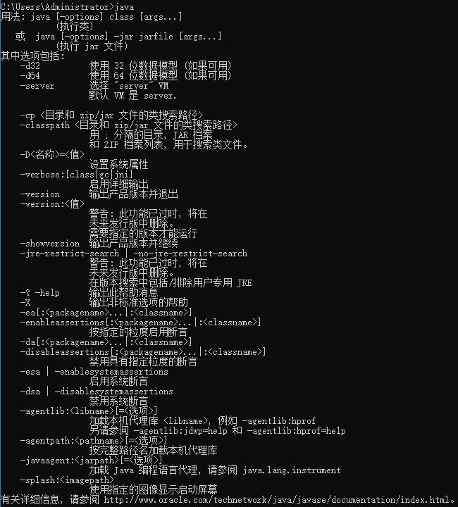

# JDWP 远程调试

##  背景

在日常开发中，大家借助 IDE 都会经历调试程序的情况，除 IDE 以外，其实 Java 还提供了一种调试程序的协议，JDWP。

典型的场景，代码在本机运行正常，发布到服务器后，就出现了各种问题。这个时候如果想定位问题位置，就变得不是那么简单了。一种是打日志，就需要把相关的日志都打印出来，还牵扯到重新部署等等问题，会非常麻烦。另外一种比较好的方式是远程调试，程序还是在服务器，把服务器的程序与本机源代码做关联，在本机可以根据断点单步调试来定位问题。

## 定义

Java Debug Wire Protocol， Java 调试协议。

无论以 main 方法运行，还是以 jar 包运行，都可以远程调试。本质来说，是通过 socket 和 端口号把服务器和客户端连接。连接建立成功以后，就可以通过断点定位到需要调试的程序。

## 观察

打开命令行，输入 `java` 命令。

再次输入 agentlib 指令。

`java -agentlib:jdwp=help`

主要是前 4 个选项。

### suspend

是否在启动的时候就等待，表示程序一启动就停下，等待远程调试 socket 和它建立连接。

### transport

传输规范，用 JDWP 调试程序一般叫做：dt_socket。

### address

地址，表示的是需要调试的地址。

### server

是否监听调试器，需要改成 y，要监听调试器。

### launch

当事件发生时运行调试器（用不到）。

### onthrow

抛出异常时（用不到）。

### onuncaught

没有捕获异常时（用不到）。

### timeout

监听超时时间。（用不到）。

### mutf8

（用不到）。

### quiet

（用不到）。

