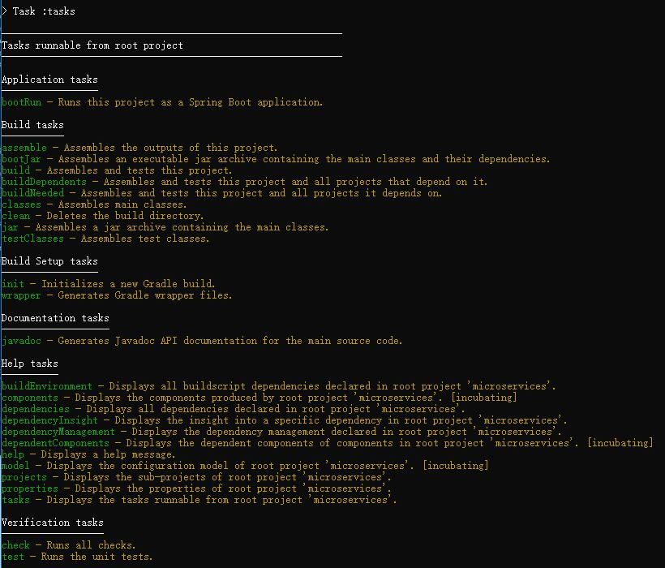

# Spring Boot 打包文件内容与结构

## Gradle 任务

指令：gradle tasks

会显示出当前工程所有可以使用的 gradle 的 task，并且给每一个 task 一个说明。

有些任务是 gradle 自带的，有些则不是。

## bootJar 任务

gradle 提供的一个任务，作用是将 Spring Boot 打包成一个独立的 jar 包。不依赖于任何其他的依赖、容器等，是一个自包含的独立 jar 包。这个 jar 包内包含运行这个工程的一切，也就是说它是一个可执行的 jar 包。

老版本的 gradle 插件命令 ：packageJar。

**注意：基于 Spring Boot 的应用，打包方式都是使用 bootJar 命令，而不是 jar 命令。jar 命令只是把工程打成一个 jar 包，但 bootJar 命令才是打包成一个可执行 jar 文件。这两种打包方式，打包出来的文件结构的差距也是非常大的。**

打包生成目录：/build/libs/microservices-0.0.1-SNAPSHOT.jar。

### 运行 bootJar 打包的文件

指令：java -jar microservices-0.0.1-SNAPSHOT.jar，和普通的运行 jar 的方式一样。

**注意：这种方式其实是 Spring Boot 应用部署的标准方式，先把工程通过 bootJar 命令打包成一个可运行的 jar 文件。然后通过 java -jar 命令来执行这个 jar 文件。**

当然 Spring Boot 应用也支持把工程打包成 war 文件，不过要把内嵌 tomcat 相关的 jar 包都删除掉，再部署到外部的 tomcat 容器中。

## bootJar 文件分析

通过 bootJar 打包后会生成一个 jar 文件，而 这个 jar 文件本身就是一个压缩文件。

### 解压缩 jar

#### java 解压缩 jar

通过 java 自带的 jar 指令解压： `jar -xvf  microservices-0.0.1-SNAPSHOT.jar`

这种方式不好的原因在于，会把解压后的所有文件都直接放在当前目录，而不能把解压后的所有文件放在一个指定的目录内。

#### unzip 解压缩 jar

通过 mac 自带的 unzip 指令解压：`unzip microservices-0.0.1-SNAPSHOT.jar -d ./microservices`

### 解压缩后的目录结构

#### BOOT-INF

传统应用开发中没有的目录结构，Spring Boot 特有的目录，里面有 2 个子目录。分别是：

##### classes

当前工程编译好的结果文件（也就是 class 字节码文件和相关配置文件）都在这里，包含 **src/main/java** 和 **src/main/resources** 下的所有文件。

##### lib

当前工程依赖的所有 jar 文件（第三方 jar 包）都在这里，居然有 36 个 jar 文件，而我们在 build.gradle 里只引入了一个 starter 的依赖。

#### META-INF

只有一个文件：MANIFEST.MF。

通过 jar 命令把一个或者若干个 class 文件打包成 jar 包时通常要指定一个文件作为清单文件。当中描述的是可执行 jar 包的基本信息。

##### Manifest-Version

清单文件版本。

##### Start-Class

Spring Boot 特有的属性（com.lichee.microservices.MicroservicesApplication），被 @SpringBootApplication 所修饰且包含 main 方法的启动类。

按照一般的经验来猜想，这个类才应该是 Main-Class 才对，但实际并不是。

##### Spring-Boot-Classes

就是 BOOT-INFO/classes 下的文件。

##### Spring-Boot-Lib

BOOT-INF/lib 下的文件。

##### Spring-Boot-Version

Spring Boot 的版本号。

##### Main-Class

一个可执行 jar 的入口文件，也就是 main 方法所在的类，jar 包文件执行的入口类。居然是 Spring Boot 提供的类（org.springframework.boot.loader.JarLauncher），而不是我们自己写的。只要我们打包方式是 jar 包方式，那么不管什么应用的 Main-Class 永远都是这个 JarLauncher。

JarLauncher：jar 文件的装载器。

**注意：有一个细节，在这个清单文件的最后，也就是在 Main-Class 文件之后，一定要有一个回车换行，Spring Boot 采用的是两个回车换行，可以观察上图。**

#### org

由 Spring Boot 提供的一堆字节码文件，入口类 org.springframework.boot.loader.JarLauncher 就在这里。

